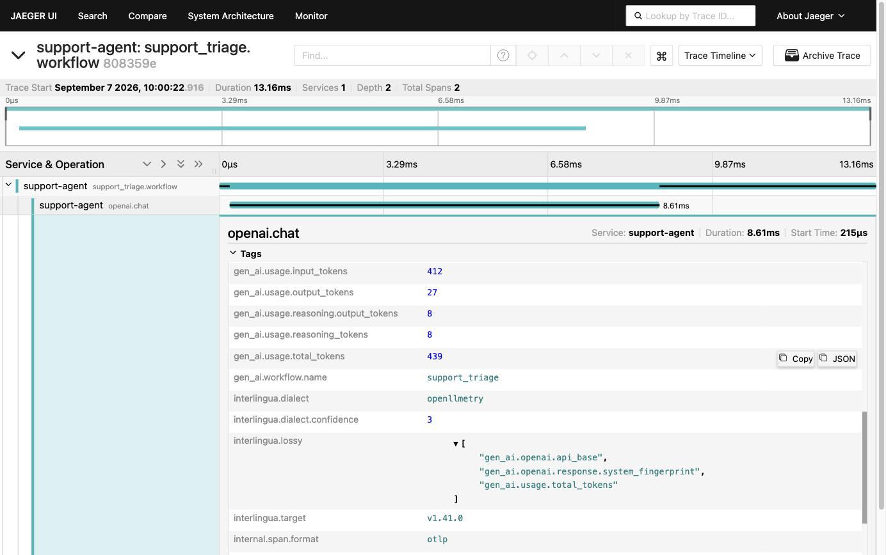
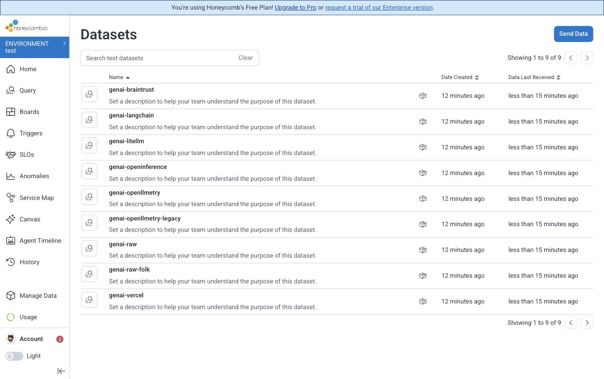

# genai-interlingua

**Normalize LLM and GenAI spans from any instrumentation library into one
`gen_ai.*` schema, and record on every span exactly what the translation cost.**

Six dialects. Six different names for the same token count. One schema out.

Runs as an [OpenTelemetry Collector processor](processor/genaiinterlingua/) or a
[standalone CLI](cmd/interlingua/). No dependencies in the core.

---

## The problem

You are running LangChain in one service, the Vercel AI SDK in another, and
LiteLLM in front of both. Your traces have three vocabularies for the same
model call:

| | prompt tokens | provider |
| --- | --- | --- |
| OpenLLMetry (older) | `gen_ai.usage.prompt_tokens` | `gen_ai.system` |
| OpenInference | `llm.token_count.prompt` | `llm.provider`, or `llm.system` |
| Vercel AI SDK | `ai.usage.promptTokens` | `ai.model.provider` |
| the conventions | `gen_ai.usage.input_tokens` | `gen_ai.provider.name` |

You cannot write one dashboard over that. So you normalize — and immediately hit
the question this repository is actually about.

**`gen_ai.*` currently has no version you can pin.** The attributes were
deprecated out of `open-telemetry/semantic-conventions` at v1.42.0 and moved to
`open-telemetry/semantic-conventions-genai`, which as of 2026-09-07 has **zero
tags, zero releases, and 21 commits in the last 30 days**. There is no schema URL
to point at. "Normalize to the GenAI conventions" is an underspecified
instruction.

So the target is an explicit choice, not a constant hidden in a table:

```
-target v1.41.0     # last cut that added to gen_ai.*. frozen, deprecated at source.  (default)
-target genai-main  # current. untagged, moving.
```

The default is the frozen cut, because it is the only one of the two a reader can
reconstruct six months from now. (A v1.41.1 patch release followed, changing
nothing in `gen_ai.*`; the target is named for the release that last added to it.)
[`docs/moving-target.md`](docs/moving-target.md) argues it out.

## Why you would use it

**You get one vocabulary.** One dashboard, one alert, one SLO over every model
call, regardless of which library instrumented it.

**You find out what it cost you.** This is the part other normalizers skip, and
it is checkable rather than rhetorical: the closest comparable component drops
silently by design, and says so in its own source — see [Components covering
similar use cases](#components-covering-similar-use-cases) below. Every span here
carries `interlingua.lossy`: the list of keys this span is *not* a faithful
carrier of. A translation layer that silently drops data is worse than no
translation layer, because you will trust the result.

**It never destroys your originals by default.** `originals: keep` is the
default. The emitter's own attributes stay on the span next to the normalized
ones, so a mapping this repository got wrong is a mapping you can still see
through.

**Detection is a judgement, and says so.** Dialects are scored, not first-matched.
The winner's margin over the runner-up is written to the span as
`interlingua.dialect.confidence`, so a misdetection is a thing you can query for
rather than a thing you discover later.

**The claims are checked by tests, not by prose.**
[`docs/conformance.md`](docs/conformance.md) is generated from the fixtures, and
CI fails if it disagrees with them. Every dialect is backed by spans captured
from the real libraries, and the table says which — a row cannot borrow
credibility it did not earn.

## Components covering similar use cases

**[`processor/genainormalizer`](https://github.com/open-telemetry/opentelemetry-collector-contrib/tree/main/processor/genainormalizerprocessor)**,
in `opentelemetry-collector-contrib` since 2026-02-13
([donation #46069](https://github.com/open-telemetry/opentelemetry-collector-contrib/issues/46069)).
Alpha, traces, and — the part that matters — **already in the `otelcol-contrib`
binary you are probably running**. It maps OpenInference and OpenLLMetry into
`gen_ai.*` from built-in tables, accepts user-defined tables for anything else,
coerces values to the types semconv declares, and stamps
`https://opentelemetry.io/schemas/1.40.0` on the scope. If those two libraries
are what you run, reach for it first: it needs no custom build and this
repository does.

Four differences, measured against `main` at 2026-09-09 (it moves; `v0.155.0`
and `main` already differ):

| | `genainormalizer` | here |
| --- | --- | --- |
| which dialect a span is | declared in config. Every listed source is applied to every span, in list order | scored per span; the winner's margin over the runner-up is written to the span |
| what the mapping cost | not recorded. `internal/otelsemconv/coerce.go:16` — *"callers must drop the attribute"*; `:91` — *"Caller drops the rename."* With `remove_originals: true` the source is deleted too | `interlingua.lossy` names the keys the span is not a faithful carrier of |
| which target | `schemas/1.40.0`, hardcoded | `-target`, an explicit choice, because [there is no version of `gen_ai.*` you can pin](docs/moving-target.md) |
| built-in dialects | OpenInference, OpenLLMetry | those two plus Vercel AI SDK, LiteLLM, Braintrust, and a shape-only fallback |

It also reconstructs indexed messages into a JSON string where this repository
builds a nested document. That is a design difference, not a gap.

**These differences are being taken upstream rather than maintained in
competition.** A second component in this space would be worse for everyone than
one good one; the useful thing this repository has is measurements and three
more mapping tables built from captured spans, and those belong in the component
that already has distribution. Progress is tracked in
[`docs/upstream.md`](docs/upstream.md).

Two adjacent components:
[`processor/transform`](https://github.com/open-telemetry/opentelemetry-collector-contrib/tree/main/processor/transformprocessor)
(general-purpose OTTL — which is why this repository can
[emit an OTTL config](#use-it-without-this-binary--emit-ottl) instead of asking
you to run its binary), and
[`processor/schema`](https://github.com/open-telemetry/opentelemetry-collector-contrib/tree/main/processor/schemaprocessor),
which applies Telemetry Schema Files by matching a signal's `schema_url` — the
mechanism [`-emit schema-file`](#-emit-schema-file-and-why-it-carries-less)
targets, and the reason the shortfall measured there is worth measuring. (#46069
also cited `processor/datadogsemantics`; it is no longer in contrib.)

## Install

```console
$ go install github.com/Grace/genai-interlingua/cmd/interlingua@latest
```

Or grab a binary from [releases](https://github.com/Grace/genai-interlingua/releases),
or build the Collector processor into your own distribution (below).

## Use it: the CLI

Reads an OTLP/JSON trace export on stdin, writes one on stdout.

```console
$ cat testdata/openllmetry-legacy/in.json | interlingua -target v1.41.0
```

That span arrives with 30 attributes in OpenLLMetry's own vocabulary. It leaves
with all 30 still on it, plus:

```
gen_ai.provider.name           = openai            # was gen_ai.system = "OpenAI"
gen_ai.operation.name          = chat              # was llm.request.type
gen_ai.request.model           = gpt-4o-mini
gen_ai.response.finish_reasons = tool_call         # was tool_calls, in gen_ai.completion.0.finish_reason
gen_ai.usage.input_tokens      = 412               # was gen_ai.usage.prompt_tokens
gen_ai.usage.output_tokens     = 27                # was gen_ai.usage.completion_tokens

interlingua.dialect            = openllmetry
interlingua.dialect.confidence = 7
interlingua.target             = v1.41.0
interlingua.lossy              = [gen_ai.completion.*, gen_ai.prompt.*,
                                  gen_ai.prompt.version,
                                  gen_ai.usage.total_tokens,
                                  traceloop.association.properties.user_id]
```

**Read the last one first.** This span is not a faithful carrier of those five
things. `gen_ai.usage.total_tokens` has no home in the conventions at all. The
indexed `gen_ai.prompt.N.*` attributes were flattened into one
`gen_ai.input.messages`. And `gen_ai.prompt.version` was dropped because
**v1.41.0 has no attribute for it** — run the same command with `-target
genai-main` and it moves out of `interlingua.lossy` and onto the span.

Flags:

| | |
| --- | --- |
| `-target` | `v1.41.0` (default) or `genai-main` |
| `-originals` | what becomes of the emitter's own attributes: `keep` (default), `dedupe` (remove exact copies only), or `prune` (remove everything a dialect read). `-strip-original` still works and means `prune`. |
| `-emit` | print the mapping instead of applying it: `ottl` or `schema-file` |
| `-dialect` | with `-emit`, which emitter to export the mapping for |
| `-version` | print version and default target |

## Use it without this binary: `-emit ottl`

You should not need a bespoke processor to rename an attribute. OTTL is a
transformation language OpenTelemetry already governs and already ships in every
Collector distribution, so the half of this mapping that can be *stated as data*
can be handed over in a language somebody else maintains:

```console
$ interlingua -emit ottl -dialect litellm -target v1.41.0 > interlingua.yaml
```

That prints a `transform` processor you can paste into your own Collector. No
Go, no custom build, no dependency on this repository continuing to exist.

The catch is that it is a **subset**, and the emitted config says which subset in
its own header rather than leaving you to find out:

```yaml
# WHAT THIS CANNOT CARRY (4 attributes)
#
#   gen_ai.input.messages
#   gen_ai.output.messages
#   gen_ai.response.finish_reasons
#   gen_ai.tool.definitions
```

Three things do not survive the trip, and all three are in the header:

**Detection does not.** `Detect` scores every dialect across the whole span and
takes the winner. OTTL has no loop and no maximum, so an exported config is
pinned to one dialect and scoped by conditions over the spellings only that
emitter uses. If two GenAI libraries report into one pipeline, route by service
first — the conditions will not tell them apart.

**The unstated mappings do not.** Reassembling `gen_ai.prompt.{i}.tool_calls.{j}.*`
into one nested document is not a transformation of a value; it is a reading of a
span. Nothing in OTTL expresses it.

**Per-span loss accounting does not.** `interlingua.lossy` is computed from what
a given span turned out to carry. What the config emits instead is
`interlingua.export.unsupported` — the same statement made structurally, about
the config rather than the span — plus `interlingua.export: ottl`, so a span
normalized this way is distinguishable downstream from one the processor
handled.

Which dialects can be exported is a property of how their rules are written, not
a feature flag. A dialect whose mappings are declared in a `Rules()` table can be
exported; one whose mappings are still performed in Go cannot, and the CLI says
so rather than emitting something that looks complete:

```console
$ interlingua -emit ottl -dialect raw
interlingua: raw does not declare its mappings as data yet, so it cannot be
exported (exportable: braintrust, litellm, openinference, openllmetry, vercel)
```

Migration is deliberately incremental. `internal/dialect/rules.go` explains where
the line falls, and `TestUnstatedIsAccurate` holds every migrated dialect to it
against the captured corpus: a field the parser produces that is neither stated
by a rule nor admitted as unstateable fails the build, because an export would
otherwise drop it while advertising that it did not.

### `-emit schema-file`, and why it carries less

The same rules also render as an [OpenTelemetry Telemetry Schema
File](https://opentelemetry.io/docs/specs/otel/schemas/file_format_v1.1.0/) —
the artifact OpenTelemetry has had for "these attributes used to be called
something else". The emitter writes format 1.1.0, which is what the spec's
schemas page still documents and what tooling still reads, but
[OTEP 4815](https://github.com/open-telemetry/opentelemetry-specification/blob/main/oteps/4815-semantic-conventions-schema-v2.md)
(merged May 2026) discontinues publishing it and the spec page has not caught up.
[`docs/oteps/README.md`](docs/oteps/README.md) covers where that leaves this
emitter. It carries much less than the processor either way, and the shape of the
shortfall is the interesting part rather than a disclaimer:

```console
$ interlingua -emit schema-file -dialect litellm -target genai-main
#     1 written here as rename_attributes
#    17 need no rename: litellm already writes the target's own attribute name
#     6 cannot be expressed in this format at all
```

Every transformation a schema file supports is a change of *name*. `gen_ai.system
→ gen_ai.provider.name` fits. `bedrock → aws.bedrock` does not — same attribute,
different value, and there is no transformation for a value. Neither does
milliseconds → seconds, or dropping a value the target's closed set does not
admit. Applying such a file alone produces spans with the right attribute names
carrying values the target schema does not define, which is arguably worse than
leaving them alone, because they now look conformant.

[`docs/export-gap.md`](docs/export-gap.md) measures all of this from the rule
tables — what the processor, an OTTL config, and a schema file each carry, and
every gap grouped by the specific missing capability. It is generated and CI
fails if it drifts.

## The provenance attributes are a published registry

[`registry/`](registry/) is a Weaver semantic convention registry defining the
the `interlingua.*` attributes — which vocabulary a span arrived in, which one
it left in, how confident the identification was, and what the trip cost.

```console
$ weaver registry check -r registry/
```

It is published as a registry rather than described in a README so that it can be
resolved and depended on without adopting any of this code.
`TestRegistryDefinesEveryAttributeWeWrite` holds it to the implementation in
both directions: an attribute written but not defined is a promise quietly
broken, and one defined but not written is documentation of a feature that does
not exist.

The namespace is deliberately this repository's own. A namespace named after one
tool has no business in a shared convention; what might belong there is the
*shape*, and [`docs/oteps/`](docs/oteps/) drafts that proposal under a neutral
name — along with a second, weaker one for adding value transforms to the schema
file format. Both are drafts. Neither is filed, and the README there says what
would have to happen first.

## Use it: the Collector processor

```yaml
processors:
  genaiinterlingua:
    target: v1.41.0
    originals: keep

service:
  pipelines:
    traces:
      processors: [genaiinterlingua, batch]
```

Build it into a distribution with [`ocb`](https://opentelemetry.io/docs/collector/custom-collector/):

```yaml
processors:
  - gomod: github.com/Grace/genai-interlingua/processor/genaiinterlingua v0.2.0
```

[`processor/genaiinterlingua/`](processor/genaiinterlingua/) is a separate Go
module, so the Collector's dependency graph stays out of the core: the mapping
can be read, run and reviewed with `go run` and no Collector build.

It is the same function as the CLI applied to a different representation.
`internal/normalize` returns a *description* of the edit rather than performing
one, so the JSON codec and the pdata processor apply one decision to two shapes.
`TestMatchesTheCLIGoldens` holds them to it by running every fixture through
pdata and comparing against the goldens the CLI committed.

An unrecognized span passes through untouched, with no `interlingua.*` on it.
This sits in a pipeline where most spans are HTTP.

## See it

```console
$ docker compose -f demo/compose.yaml up --build
$ open http://localhost:16686
```

Four services: an agent instrumented with **real OpenLLMetry**, a mock model,
this processor in an `ocb`-built Collector, and Jaeger. Nothing reaches the
internet and no API key is needed.



That is a real span from that stack, and it is worth reading closely:

- **`gen_ai.usage.reasoning_tokens: 8`** is what OpenLLMetry emitted — the
  conventions' field, misspelled without its `.output` segment.
  **`gen_ai.usage.reasoning.output_tokens: 8`** is the normalized one directly
  below it. *(That mapping exists because capturing a real span found it
  missing.)*
- **`gen_ai.usage.total_tokens: 439`** is on the span **and** named in
  `interlingua.lossy`. `originals: keep` did not throw it away, and the span
  says plainly that the conventions have no field for it.
- **`interlingua.dialect: openllmetry`** with **`confidence: 3`** — low, and
  honestly so: current OpenLLMetry has largely migrated to the conventions, so
  most of what used to identify it is now just conformance.
- **`interlingua.target: v1.41.0`** — which vocabulary those `gen_ai.*` keys
  belong to, on the span, because there is no schema URL to carry it.

The Collector's OTLP port is published, so you can push any fixture in from the
host — `testdata/litellm/in.json` comes back with 53 entries in
`interlingua.lossy`, because LiteLLM writes a great deal the conventions have no
words for.

## How to integrate with Honeycomb

Honeycomb is the worked example here because it has a purpose-built GenAI view
that reads the conventions directly, which makes the difference normalization
makes unusually easy to see. Nothing in the repository is Honeycomb-specific:
it is an OTLP exporter and a set of queries, and the same spans work anywhere.

### 1. Get an ingest key

Honeycomb → **Environment settings → API Keys** → create a key with **Send
Events**.

This is an *ingest* key, and it is not the same credential as the one
Honeycomb's MCP server or the management API uses. Sending with the wrong one
returns a 401 that does not explain itself, so it is worth checking first.

### 2. Add the exporter

Honeycomb ingests OTLP directly, so there is no vendor exporter to install:

```yaml
exporters:
  otlp/honeycomb:
    endpoint: api.honeycomb.io:443        # api.eu1.honeycomb.io:443 on the EU instance
    headers:
      x-honeycomb-team: ${env:HONEYCOMB_API_KEY}

service:
  pipelines:
    traces:
      processors: [genaiinterlingua, batch]
      exporters: [otlp/honeycomb]
```

`x-honeycomb-dataset` is Honeycomb Classic only. Current environments route by
the key and split into datasets by `service.name`.

[`demo/otelcol-honeycomb.yaml`](demo/otelcol-honeycomb.yaml) is the complete
config this comes from.

### 3. Send something

With Docker, the demo has a profile for it:

```console
$ HONEYCOMB_API_KEY=... docker compose -f demo/compose.yaml --profile honeycomb up --build
```

Without Docker, push the repository's own fixtures straight in — nine fixtures across six
dialects, one service each:

```console
$ HONEYCOMB_API_KEY=... python3 demo/send-to-honeycomb.py
```

A service per dialect is the situation worth modelling: not one service that
cannot make up its mind, but several teams that each picked a different
instrumentation library.



### 4. Check that it worked

The fast check is Honeycomb's **Gen AI** panel on any model-call span. It is
populated entirely from the conventions, so it is a direct read-out of whether
your spans are conformant:


Operation, provider, model, response ID, the request parameters, and the token
counts — all read from `gen_ai.*`.

**Here is the same span, from the same library, without the processor in the
pipeline:**


There is no Gen AI tab. Not an empty one — the panel does not appear, because
nothing on the span is in a vocabulary it recognizes. The data is all still
there, spelled `gen_ai.completion.0.tool_calls.0.arguments` and
`gen_ai.usage.prompt_tokens`, as a flat list nobody can aggregate.

Send both yourself and compare:

```console
$ python3 demo/send-to-honeycomb.py           # normalized
$ python3 demo/send-to-honeycomb.py --raw     # the same spans, untouched
```

### Then the queries worth running

```
SUM(gen_ai.usage.input_tokens) GROUP BY gen_ai.provider.name, interlingua.dialect
```


**4120 tokens across nine services and six dialects.** Ask the same question in
OpenLLMetry's own vocabulary — `gen_ai.usage.prompt_tokens` — and you get 412
from one service, because that is the only service that spells it that way.

[`docs/honeycomb.md`](docs/honeycomb.md) has the rest, including which library
is costing you the most data, how Honeycomb stores an array attribute (as a
JSON string, which is why `interlingua.lossy.count` exists), and a query that
came back wrong the first time. Every number in it was measured, not reasoned
about.

## What it recognizes

| Dialect | What it is |
| --- | --- |
| `openllmetry` | Traceloop / OpenLLMetry, `gen_ai.prompt.N.*` and `traceloop.*` |
| `openinference` | Arize OpenInference, `llm.*` with indexed messages |
| `vercel` | Vercel AI SDK, `ai.*` outer spans and `gen_ai.*` adapter spans |
| `litellm` | LiteLLM, largely already conformant plus `litellm.*` and `metadata.*` |
| `braintrust` | Braintrust, scores and metrics in packed JSON blobs |
| `raw` | fallback for spans that are already conformant, or nearly |

Detection is scored, not first-match: every dialect reports how much evidence it
found, the highest score wins, and the margin over the runner-up is recorded as
`interlingua.dialect.confidence`. A confidence of `0` next to a surprising
dialect is a misdetection you can query for, which is why it goes on the span
instead of into a log line.

The fallback is deliberately kept out of that contest until every real dialect
has declined, so that backing up the dialects does not dilute their margins.

A span carrying no GenAI evidence is returned exactly as it arrived, with no
`interlingua.*` on it at all. This runs in a pipeline where most spans are HTTP.

## Loss is an output, not a log line

Two separate vocabularies, because they are two different people's fault:

- **`dialect.Reason`** — what the emitter said that the intermediate
  representation could not hold. `no_field`, `unstructured`, `flattened`,
  `coerced`, `ambiguous`.
- **`normalize.Reason`** — what survived that, and then hit a target schema with
  no attribute (`no_attribute`) or no such value (`no_value`) for it.

`interlingua.lossy` flattens both into one list, because a consumer scanning for
a key they care about does not care which half of the pipeline dropped it.

[`COMPATIBILITY.md`](COMPATIBILITY.md) explains every code, and lists the
transformations that change your data *without* being losses: provider names
rewritten, `gen_ai.system` renamed, finish reasons respelled onto `tool_call`,
Vercel's milliseconds divided into the conventions' seconds. Those are the ones
worth reading, because they change your values silently and correctly.

## The conformance table is generated

[`docs/conformance.md`](docs/conformance.md) is written by
`TestConformanceTable`, not by hand, from the fixtures themselves. Fields are
recovered from the rendered attribute keys, so a dialect gets credit for a field
only if the whole pipeline actually emitted it. Editing the table to claim
something the fixtures do not demonstrate fails the test.

Its header says what it is and is not: a mark is evidence, a blank is silence.
It also reports, per dialect, whether the inputs behind a row were **captured**
from a running library or **hand-built** here, read from a marker file next to
each fixture so that account cannot drift from the truth.

Seven of the nine fixtures are captured. The two hand-built ones are
`openllmetry-legacy` -- the indexed shape OpenLLMetry used to emit and no longer
does -- and `raw-folk`, hand-rolled attribute names that no library emits.
`testdata/capture/capture.sh` runs the real libraries against a local mock
OpenAI server -- no API key, nothing sent anywhere -- and records what they put
on the wire.

Four of those captures found a bug that hand-built fixtures had hidden:

- **OpenLLMetry** has migrated to the conventions, and four attributes it now
  emits were being silently walked past -- including
  `gen_ai.usage.reasoning_tokens`, the conventions' own field misspelled by the
  emitter without its `.output` segment.
- **OpenInference** sets `llm.system` and no `llm.provider` on OpenAI calls, so
  the provider was being recorded as a redundant loss and discarded while the
  answer sat unread on the span. Its `llm.finish_reason` was not read at all.
- **LiteLLM** scored a dead tie with OpenLLMetry on its own span, winning only
  by being registered first. It also emits twelve `gen_ai.cost.*` attributes,
  none of which the conventions price at any version and none of which were
  being recorded.

- **`raw`**, captured from OpenTelemetry's *own* first-party instrumentation --
  the control case -- was silently walking past
  `openai.response.system_fingerprint`. `openai.` and `mcp.` are namespaces the
  conventions themselves own, so a leftover in them is GenAI data that could not
  be placed, and it is now recorded.

The Vercel and LangChain captures found nothing, which is the other useful
outcome — and the LangChain one is a useful negative specifically, because it is
Traceloop's instrumentation and the OpenLLMetry parser read it correctly on the
first pass without having been written against it. The Braintrust capture found
nothing wrong with the *parser* but removed three marks the hand-built fixture
had been claiming, which is the same lesson pointed at the evidence instead of
the code.

**[`docs/findings.md`](docs/findings.md) is all of it in one place** — what each
fixture had assumed, what the library actually did, and why none of it was
reachable by a test suite that was already green.

That `raw` capture also answers a question the rest of the repository only
argues about: normalize the reference implementation's span to both targets and
the entire difference is the value of `interlingua.target`. Every attribute
OpenTelemetry's own instrumentation emits today is expressible at the frozen
v1.41.0 cut, which is the best available argument for it being the default. See
[`docs/moving-target.md`](docs/moving-target.md).

The two hand-built fixtures stay hand-built for the same reason: nothing emits
them any more. `openllmetry-legacy` is the indexed shape the library has since
migrated away from, and `raw-folk` is bare names like `prompt_tokens` that
somebody wrote by hand. Details in [`testdata/README.md`](testdata/README.md).

## Staying current with a moving target

A repository arguing that `gen_ai.*` moves should not encode it as a snapshot
nobody checks. Three things move independently here, and each has something
watching it.

**The schema.** `internal/semconv` is *generated* from upstream, not transcribed
from it. Both registries — `semantic-conventions-genai` at a pinned commit, and
`semantic-conventions` at the frozen `v1.41.0` tag — are vendored under
`internal/semconv/testdata/upstream/`, and `internal/semconv/gen` reads them to
write `targets_gen.go`. What stays hand-authored is the editorial half and only
that: which concepts are modelled at all (`AllFields`), plus the one field whose
key is not derivable, `gen_ai.usage.cache_write.input_tokens`, which v1.41.0
spells `cache_creation`. Whether a target defines a field, what it spells it, and
what values it accepts are upstream's to say and are read from upstream.

Three checks hold it there. `TestSchemaMatchesUpstream` walks the tables and asks
whether upstream agrees. `TestGeneratedTablesAreCurrent` walks upstream and asks
whether the tables are complete — the direction a stale generated file actually
fails in, when somebody adds a field and forgets to regenerate. And CI reruns
`go generate` and insists nothing moved. Attributes upstream defines that this
repository does not model are reported rather than failed, because choosing not
to model one is editorial and not knowing about it is a bug. All 50 and all 72
currently match.

They are vendored as JSON rather than YAML so the core module keeps having no
dependencies; a Go YAML parser would show up in `go.mod` even as a test import.

**The emitters.** Every fixture carries `VERSIONS` and `KEYS`. Nothing is
pinned — re-capturing is supposed to pick up new releases — so `KEYS` compares
attribute key *sets*, which is what actually changes when a library migrates,
rather than bytes, which change on every capture because trace ids do.

**The release that would change everything.** A weekly job asks whether
`semantic-conventions-genai` has tagged anything yet. While the answer is no,
nothing happens. When it becomes yes, it opens an issue containing the to-do
list from `docs/moving-target.md`, because that document currently argues from
the absence of exactly that event.

Neither scheduled job commits anything. Deciding what a new attribute means is
the interesting part and is not automatable.

## Layout

```
internal/semconv     what each target schema can express. no emitters.
internal/dialect     what each emitter says. no schema versions.
internal/normalize   the only place the two meet, plus the OTLP/JSON codec.
cmd/interlingua      stdin to stdout.
internal/emit        the same mappings as OTTL and as a schema file.
wasm.go              the same mappings in a browser. builds with demos/build.sh.
processor/…          the same, as a Collector processor. own module.
testdata/            nine fixtures x two targets, plus the capture harness.
```

`internal/semconv` and `internal/dialect` do not import each other and neither
knows the other exists. Normalizing is exactly the question of what happens when
a dialect says something a target has no words for, and it is worth having one
file where that is the only question being asked.

## Preserving originals

`originals` defaults to **keep**, and `-originals` sets it on the CLI. The
default keeps the emitter's own attributes beside the normalized ones: the
`openllmetry-legacy` span used above goes in with 30 attributes and comes out
with 50. (The HTTP span sharing that trace goes in with 3 and comes out with 3.)

`dedupe` removes only the originals the span now carries unchanged under a
conventions name, and brings that span to 42; nothing it removes exists nowhere
else on the span. `prune` removes everything a dialect read, the keys listed in
`interlingua.lossy` included, and brings it to 26. The v0.5.0 names still work:
`-strip-original` is `-originals prune`, and `preserve_original: true` and
`false` are `keep` and `prune`.

Keep is the right default anyway: a normalizer that is sometimes wrong should not
also be the last reader of its input. Move to dedupe when size matters, and to
prune only once you trust the mapping for the emitters you actually run.

## Status

Go 1.25 for the core, 1.26 for the processor module (the Collector's floor).
`gofmt`, `go vet ./...` and `go test -race ./...` are green in both modules, and
`-update` is idempotent for the goldens and the conformance table.

CI runs both modules, checks the generated files regenerate identically, builds
a real Collector to assert the processor registers in it, and fuzzes the codec.

### What it costs per span

Apple M1 Pro, `go test -bench . -benchmem`:

| | ns/op | allocs/op | B/op |
| --- | --- | --- | --- |
| Decline a non-GenAI span (library) | 943 | **1** | 16 |
| Decline a non-GenAI span (Collector) | 2,331 | 3 | 832 |
| Normalize a GenAI span (library) | 15,091 | 88 | 18,840 |
| Normalize a 2-span batch (Collector) | 39,472 | 216 | 37,592 |
| Full CLI path: decode, normalize, encode | 116,368 | 316 | 76,530 |

**Read the first two rows first.** Almost every span in a real pipeline is an
HTTP handler or a database call, so the cost of *declining* is paid constantly
while normalization is paid rarely. Declining costs one 16-byte allocation in
the library.

It allocates three times in the Collector, and that is worth being straight
about: the pdata path builds an attribute map before it knows whether any
dialect will claim the span, so non-GenAI traffic pays 832 bytes of garbage per
span. At
50k spans/second that is around 40MB/s of allocation for spans nobody
normalizes. The fix is to let the dialects score against a view over
`pcommon.Map` rather than a converted map, which is a real refactor rather than
a tweak. The benchmark exists so that this is a known number instead of a
surprise.

### Fuzzing

`internal/normalize/otlp.go` is a hand-written OTLP/JSON codec, which is the one
part of this that reads bytes nobody here wrote. In a Collector it is fed by the
network, and a panic in a processor takes down a pipeline carrying every span in
the service.

`FuzzPayload` seeds from every fixture plus the degenerate shapes fixtures
cannot reach, and asserts two properties beyond not panicking: output that
claims to be encoded must decode, and **span count must be preserved** — a
pipeline that silently loses spans is worse than one that fails loudly. 3.7
million executions, no crashers. CI runs the seed corpus on every commit and
fuzzes for 60s on pushes to `main`.

Released with goreleaser on a `v*` tag, after the other three jobs pass.

Every dialect is backed by captured spans, including `raw`, which is captured
from OpenTelemetry's own first-party instrumentation.

## License

[Apache License 2.0](LICENSE). Contributions require a
[sign-off](CONTRIBUTING.md) certifying the [DCO](DCO).

Everything up to and including `v0.2.0` was released under the MIT License and
stays MIT — a license is granted at the point of distribution and cannot be
withdrawn from a copy already handed over. Apache 2.0 applies from the next
release forward, and the choice is not neutral: the processor here is meant to
be proposed to `opentelemetry-collector-contrib`, which requires Apache 2.0 of
every component, and the semantic convention registries this repository vendors
under `internal/semconv/testdata/upstream/` are Apache 2.0 already. Matching the
license of the thing you intend to join is cheaper done now than at the point
someone asks. Apache 2.0 also carries an express patent grant, which MIT leaves
to inference.
