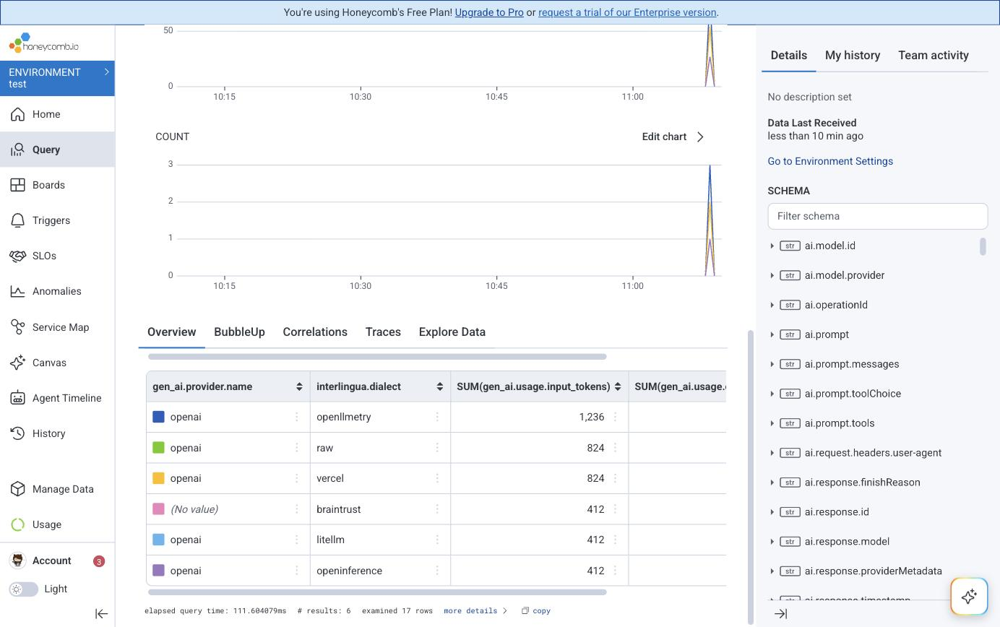
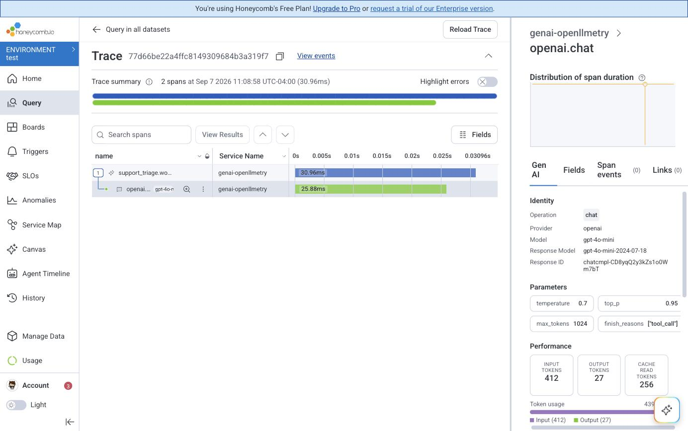
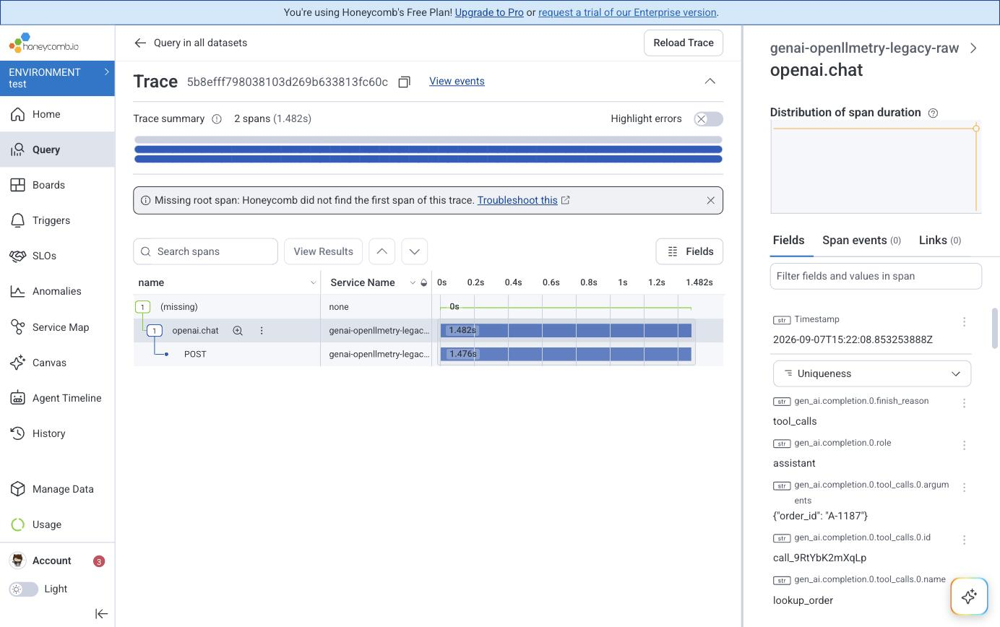

# Querying normalized GenAI spans in Honeycomb

Honeycomb ingests OTLP, so pointing this processor at it is four lines of
config. That part is not interesting. What is interesting is which questions
become answerable once every service speaks one vocabulary — and this document
records queries that were actually run, against real spans, with the numbers
that came back.

The dataset behind every number below is the repository's own fixtures: seven
captured dialects sent as seven services, so `service.name` says which library
instrumented each one. Reproduce it with `demo/send-to-honeycomb.py`.

## The exporter

```yaml
exporters:
  otlp/honeycomb:
    endpoint: api.honeycomb.io:443       # api.eu1.honeycomb.io:443 on the EU instance
    headers:
      x-honeycomb-team: ${env:HONEYCOMB_API_KEY}
```

`x-honeycomb-dataset` is Honeycomb Classic only; current environments route by
the key and split by `service.name`. `demo/otelcol-honeycomb.yaml` is the whole
config, behind `--profile honeycomb` so the default demo needs no account.

## The query that only works afterwards

Token spend by provider, across every service, regardless of what instrumented
it:

```
SUM(gen_ai.usage.input_tokens), SUM(gen_ai.usage.output_tokens)
GROUP BY gen_ai.provider.name, interlingua.dialect
WHERE gen_ai.usage.input_tokens exists
```

| COUNT | input | output | provider | dialect |
| --- | --- | --- | --- | --- |
| 3 | 1236 | 81 | openai | openllmetry |
| 2 | 824 | 54 | openai | raw |
| 2 | 824 | 54 | openai | vercel |
| 1 | 412 | 27 | | braintrust |
| 1 | 412 | 27 | openai | litellm |
| 1 | 412 | 27 | openai | openinference |
| **10** | **4120** | **270** | | |



Now ask the same question in the emitter's own vocabulary — OpenLLMetry's
pre-migration spelling:

```
SUM(gen_ai.usage.prompt_tokens) GROUP BY service.name
```

| COUNT | SUM | service.name |
| --- | --- | --- |
| 1 | 412 | genai-openllmetry-legacy |

**4120 tokens across five libraries, or 412 from one service.** That is the
entire argument for normalizing, and it is why the answer is a schema question
rather than a dashboard question. Before normalization this needs one query per
library, each with a different field name, and the results cannot be summed
because nothing guarantees the fields mean the same thing.

Braintrust's blank provider is not a bug: its ingestion contract defines no
provider field, `testdata/README.md` explains why, and the row is blank rather
than guessed.

## Which library is costing you data

```
MAX(interlingua.lossy.count), AVG(interlingua.lossy.count)
GROUP BY interlingua.dialect  ORDER BY MAX DESC
```

| AVG | COUNT | MAX | dialect |
| --- | --- | --- | --- |
| 49 | 1 | 49 | litellm |
| 10 | 1 | 10 | openinference |
| 5.17 | 6 | 9 | openllmetry |
| 5 | 2 | 7 | braintrust |
| 3 | 2 | 5 | raw |
| 3 | 3 | 5 | vercel |

LiteLLM writes forty-nine attributes per span that the conventions have no home
for — costs, proxy tenancy, routing decisions. That is not a criticism of
LiteLLM; it is a number you could not previously get, and it tells you what you
would lose by trusting `gen_ai.*` alone for those services.

**This query is the reason `interlingua.lossy.count` exists.** Which brings us
to the thing worth knowing before you design attributes for Honeycomb.

## Arrays become strings

`interlingua.lossy` is an array of strings on the span. Honeycomb stores it as a
**string**, JSON-encoded:

```
interlingua.lossy        string    ["gen_ai.openai.api_base","gen_ai.usage.total_tokens"]
interlingua.lossy.count  integer   3
```

That was checked by sending a span and reading the column type back, not assumed
from documentation — Honeycomb's docs do not specify it.

The consequence is practical. You can still `contains`-filter the array, which
is enough to answer "which spans lost this particular key". You cannot `GROUP
BY` it, average it, or threshold it, so every query in the previous section
would be impossible with the array alone. Hence the companion integer, written
on every normalized span including the lossless ones — a query for spans that
lost nothing should be `interlingua.lossy.count = 0`, not the absence of a
field.

This is not a Honeycomb quirk to work around. Most columnar backends treat an
array attribute the same way, and the fix — emit the scalar you intend to
aggregate — is right everywhere.

## The Gen AI panel is a pass/fail test for conformance

Honeycomb renders a **Gen AI** tab on model-call spans, built entirely from the
conventions. That makes it the shortest available check on whether a span is
actually conformant, because it either appears or it does not.

Normalized, from the OpenLLMetry capture:



The same span, sent without the processor in the pipeline:



The tab is not empty. It is **absent** — nothing on the span is in a vocabulary
the panel recognizes, so there is nothing for it to render. Every value is still
present, spelled `gen_ai.completion.0.tool_calls.0.arguments` and
`gen_ai.usage.prompt_tokens`, in a flat list that no aggregate can reach.

`demo/send-to-honeycomb.py --raw` sends the untouched fixtures alongside the
normalized ones so this comparison can be reproduced rather than taken on trust.

A second, smaller version of the same evidence: querying
`gen_ai.usage.input_tokens` on the un-normalized dataset fails outright, because
the column does not exist there. Honeycomb's error helpfully suggests
`gen_ai.usage.prompt_tokens` instead — which is the whole problem in one
sentence.

## Honeycomb knows the conventions, and it shows

Honeycomb annotates columns with their semantic-convention definitions, and the
annotations are a free second opinion on this repository's mappings:

| Column | Honeycomb's description |
| --- | --- |
| `gen_ai.usage.reasoning.output_tokens` | "The number of output tokens used for reasoning…" |
| `gen_ai.usage.reasoning_tokens` | *(none)* |
| `gen_ai.request.stream` | "Indicates whether the GenAI request was made in streaming mode." |
| `gen_ai.is_streaming` | *(none)* |

The described ones are conventions. The bare ones are OpenLLMetry's own
spellings, which this repository maps *from* — and both pairs are mappings added
after a capture showed the emitter using the left-hand name. An independent
source agreeing on which spelling is real is a better check than any test in
this repository, because it is not derived from the same assumptions.

Honeycomb also labels `gen_ai.openai.response.system_fingerprint` as "Deprecated,
use `openai.response.system_fingerprint`", which corroborates treating `openai.*`
as a namespace the conventions own — the reason `raw` records leftovers there
instead of ignoring them. See `docs/moving-target.md`.

The practical version: **normalized spans arrive self-describing, and the
emitter's own attributes arrive bare.**

## Misdetections are a population, not a log line

Detection is scored, and the margin over the runner-up is written to the span.
Zero means the winner tied, so the dialect was settled by registry order rather
than by evidence — which is a thing you want to find out about.

The naive query is wrong, and running it is how I found out:

```
COUNT GROUP BY interlingua.dialect, service.name
WHERE interlingua.dialect.confidence = 0
```

| COUNT | dialect | service.name |
| --- | --- | --- |
| 1 | raw | genai-raw |
| 1 | raw | genai-raw-folk |

Both hits are `raw`, and both are expected. `raw` is the fallback, deliberately
held out of the scoring contest until every real dialect has declined, so it
*always* reports a margin of zero. It has nothing to tie with. Alerting on this
query would page you about the fallback doing its job, for ever.

The query that means something excludes it:

```
COUNT GROUP BY interlingua.dialect, service.name
WHERE interlingua.dialect.confidence = 0 AND interlingua.dialect != "raw"
```

| COUNT |
| --- |
| 0 |

Zero is the healthy answer: no span was claimed by a real dialect that another
dialect had equal evidence for. That is a trigger worth setting, and the empty
result is the baseline it should hold at.

The general point is that the normalizer's own uncertainty is queryable data
rather than a log line nobody reads — and, like any signal, it needs one round
of looking at the results before you trust the threshold.

## Why this matters for Agent Timeline and LLM Observability

Honeycomb Intelligence renders agent behaviour from span attributes. It can only
show a tool call it can find, and "the tool name" is
`ai.toolCall.name` in one service and
`llm.output_messages.0.message.tool_calls.0.tool_call.function.name` in another.
A timeline built over unnormalized GenAI telemetry has a hole in it for every
team that picked a different library — and nobody notices, because a missing
span looks like a call that did not happen.

That is the case for doing this at the pipeline rather than in each app: one
processor, and every downstream feature that depends on consistent `gen_ai.*`
starts working for services nobody re-instrumented.
